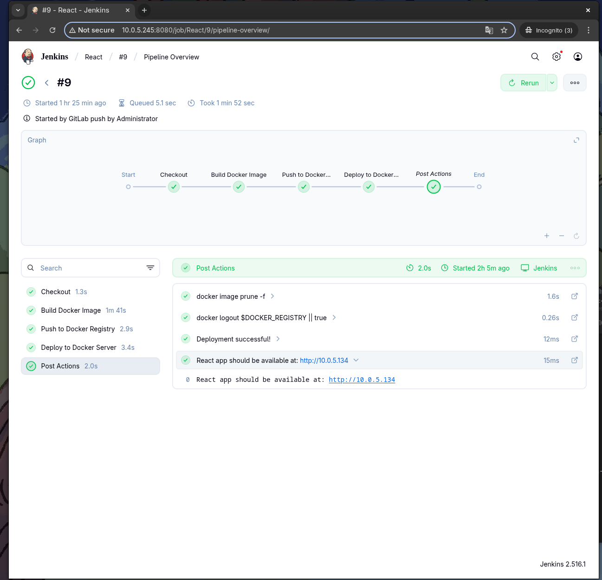
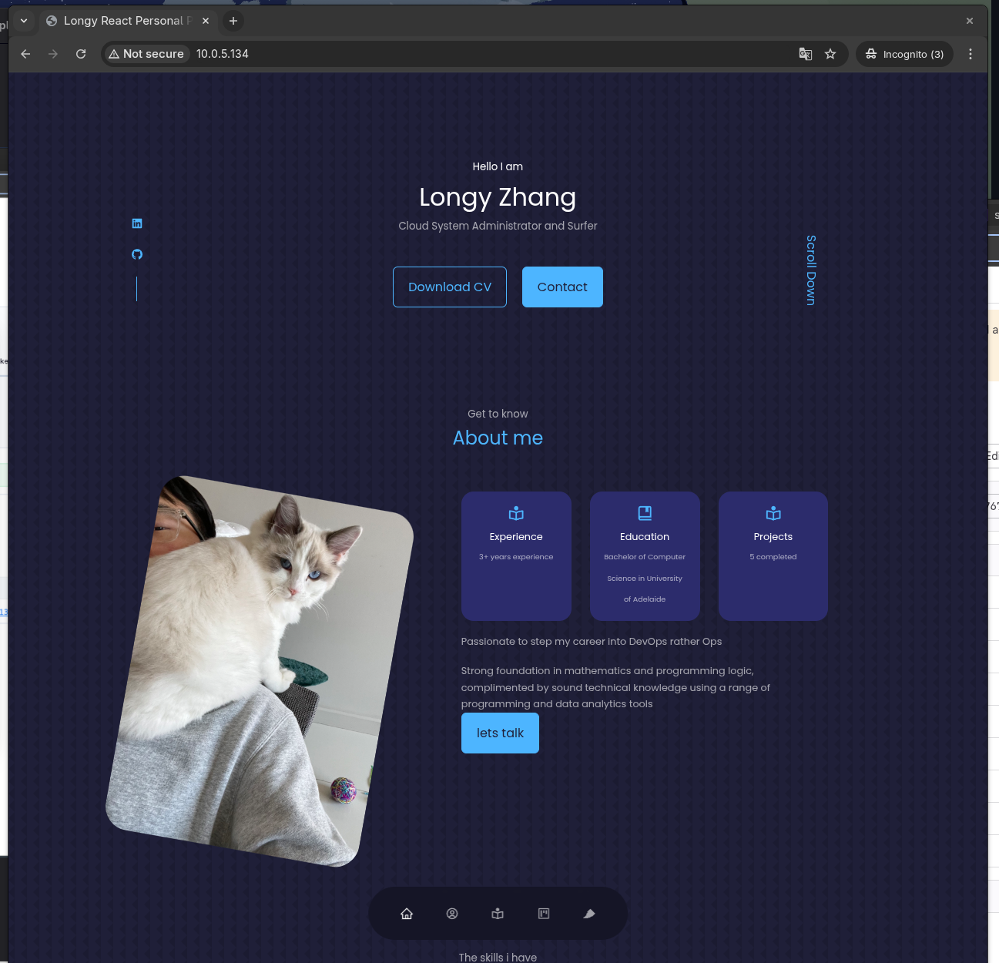

# Terraform Jenkins GitLab Tailscale Project

## 🎯 Overview

This project deploys a complete CI/CD infrastructure on AWS using Terraform, featuring Jenkins, GitLab, and Docker in a secure private network accessible via Tailscale VPN. The setup enables automated deployment pipelines while maintaining security best practices with private subnets and VPN-only access.

## 🏗️ Architecture

The infrastructure deploys a Jenkins GitLab CI/CD and Docker pipeline on EC2 instances within private subnets, with a Tailscale VPN server providing secure access to private resources through a custom VPC on AWS.

### Infrastructure Components

- **VPC**: Custom Virtual Private Cloud (10.0.0.0/16) with public and private subnets
- **NAT Gateway**: Provides outbound internet access for private subnets
- **Internet Gateway**: Enables internet access for public subnet
- **EC2 Instances**:
  - VPN Master (Public subnet) - Tailscale VPN server
  - Jenkins Node (Private subnet) - CI/CD automation
  - GitLab Node (Private subnet) - Source code management
  - Docker Node (Private subnet) - Application deployment

## 📊 Network Diagram

## 🔄 Gitlab CI Example


```
┌─────────────────────────────────────────────────────────────────────────────┐
│ VPC Network (10.0.0.0/16)                                                  │
│                                                                             │
│ ┌─────────────────┐ ┌─────────────────┐ ┌─────────────────┐               │
│ │ VPN Server      │ │ GitLab Server   │ │ Jenkins Server  │               │
│ │                 │ │                 │ │                 │               │
│ │ IP: 10.0.5.xxx  │ │ IP: 10.0.5.213  │ │ IP: 10.0.5.213  │               │
│ │                 │ │                 │ │ (Same as GitLab)│               │
│ │ - Tailscale     │ │ - Local GitLab  │ │                 │               │
│ │ - Remote Access │ │ - CI/CD Trigger │ │ - Builds Images │               │
│ │ - Subnet Route  │ │ - Code Storage  │ │ - Runs in Docker│               │
│ └─────────────────┘ │ - Port: 8929    │ │ - Port: 8080    │               │
│                     └─────────────────┘ └─────────────────┘               │
│                                                                             │
│ ┌─────────────────┐                                                         │
│ │ Docker Server   │                                                         │
│ │                 │                                                         │
│ │ IP: 10.0.5.88   │                                                         │
│ │                 │                                                         │
│ │ - Production    │                                                         │
│ │ - React App     │                                                         │
│ │ - nginx:80      │                                                         │
│ │ - Auto-restart  │                                                         │
│ └─────────────────┘                                                         │
└─────────────────────────────────────────────────────────────────────────────┘
```

## 🔄 CI/CD Workflow

```
┌─────────────┐      ┌─────────────┐    ┌─────────────┐     ┌─────────────┐
│ Developer   │────▶│ GitLab      │────▶│ Jenkins   │────▶│ Docker   │
│             │     │ Server      │     │ Server      │     │ Server      │
│ - Code      │ git │             │hook │             │ ssh │             │
│ - Commit    │push │ 10.0.5.213  │     │ 10.0.5.213  │     │ 10.0.5.88   │
│ - Push      │     │ :8929       │     │ :8080       │     │ :80         │
└─────────────┘     └─────────────┘     └─────────────┘     └─────────────┘
       │                   │                   │                   │
       │                   │                   │                   │
   ┌───▼───┐           ┌───▼───┐           ┌───▼───┐           ┌───▼───┐
   │Gitlab │           │Webhook│           │ Build │           │React App│
   │Repo   │           │Trigger │          │& Deploy│          │Running │
   └───────┘           └───────┘           └───────┘           └───────┘
```

## 🔄 Gitlab CI Example


## 🔄 Jenkins CD Example


## 🔄 Deployed React Example


## 🚀 Deployment Process

1. **Code Development** → Push to GitLab
2. **GitLab** → Webhook triggers Jenkins
3. **Jenkins** → Builds Docker image
4. **Jenkins** → Pushes to Docker Hub
5. **Jenkins** → SSH deploys to Docker Server
6. **Docker Server** → Serves React app to users

## 📁 Project Structure

```
.
├── main.tf                 # Root Terraform module
├── variables.tf            # Input variables definition
├── outputs.tf             # Terraform outputs
├── modules/
│   ├── vpc/               # VPC, subnets, IGW, NAT Gateway
│   ├── ec2/               # Jenkins + VPN + app instances
│   └── security/          # Security groups configuration
├── user_data/
│   └── user_data.sh       # Jenkins setup script
└── README.md              # This file
```

## 🔐 Security & Access

### Network Security
- **VPC Isolation**: All servers isolated within custom VPC
- **Security Groups**: Granular port access control
- **VPN Access**: Tailscale VPN required for management access
- **SSH Keys**: Secure server-to-server communication

### Application Security
- **GitLab**: Internal git operations only
- **Jenkins**: Controlled Docker socket access
- **Docker Server**: Only port 80 exposed for application access

## 🛠️ Prerequisites

- AWS Account with appropriate permissions
- Terraform >= 1.0
- Tailscale account and auth key
- SSH key pair for EC2 access

## 🔌 Connection Flow

```
Developer (via VPN)
        │
        ▼
┌─────────────────────────────────────────┐
│ VPC Network                             │
│                                         │
│ Developer ──git push──▶ GitLab          │
│                │                        │
│             webhook                     │
│                ▼                        │
│              Jenkins                    │
│                │                        │
│           build/deploy                  │
│                ▼                        │
│            Docker Server                │
│                                         │
│ End Users ──http://10.0.5.88──▶ React App │
└─────────────────────────────────────────┘
```

## 📝 Notes

- This project uses AWS CloudGuru sandbox environment
- IP addresses may vary as sandbox environments reset every 4 hours
- Tailscale advertises private subnet routes for secure access
- Jenkins and Gitlab runs in Docker Compose for easy management

## 📄 License

This project is open source and available under the MIT License.

## 🆘 Support

If you encounter any issues or have questions, please open an issue on this page.

