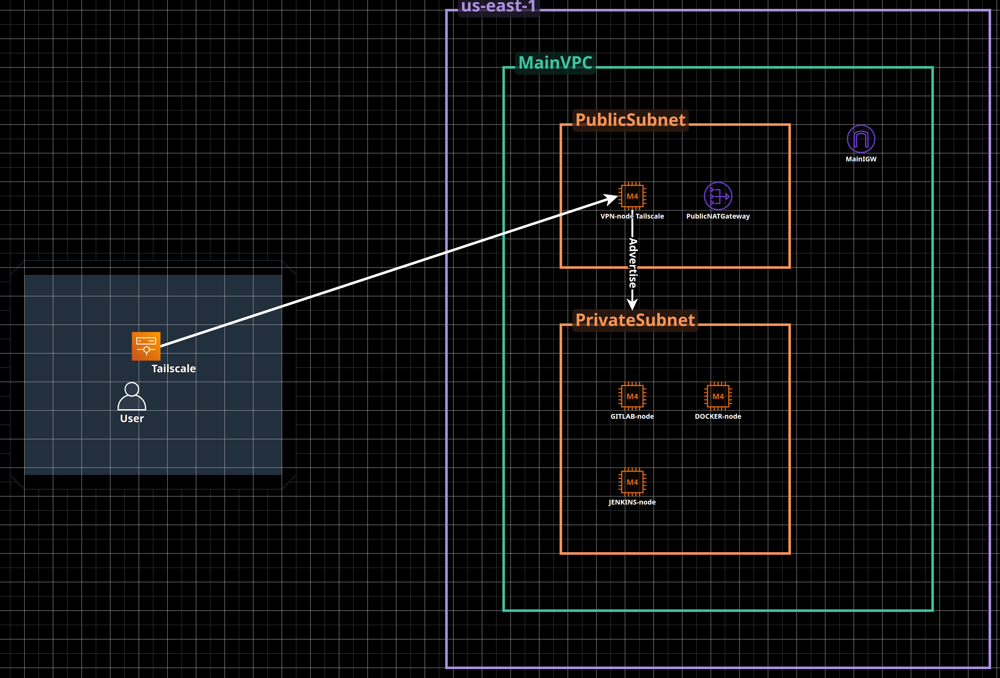
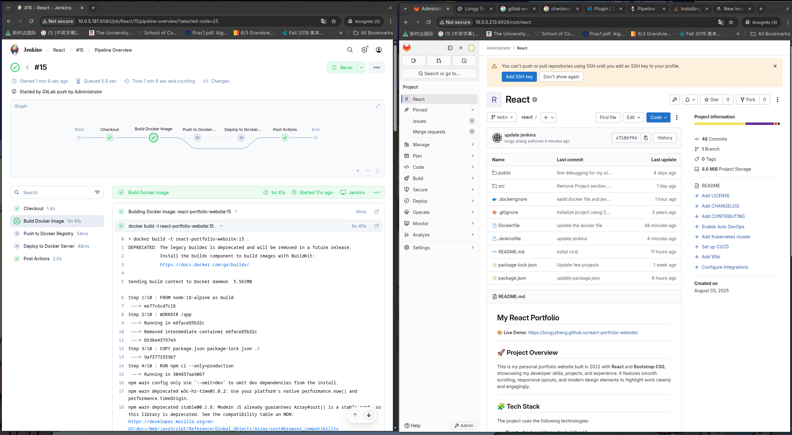

# Jenkins CI/CD with Private EC2 Access via VPN (Terraform + AWS + Tailscale)

## 📌 Overview

This project deploys a Jenkins GItlab CI/CD and docker pipeline on an EC2 instance in a **Private subnet**, and Tailsacle VPN server in **private subnets**, all within a custom VPC on AWS. Tailscale is used for secure access to private EC2 resources over a VPN tunnel. The infrastructure is fully provisioned using **Terraform**.


## 🗂️ Architecture

- **VPC** with public and private subnets
- **NAT Gateway** for outbound internet access from private subnets
- **Internet Gateway** for public subnet
- **EC2 (VPN Master)** in the public subnet
- **EC2 (jenkins Nodes)** in private subnets
- **EC2 (Gitlab Nodes)** in private subnets
- **EC2 (DOcker Nodes)** in private subnets 
- **Tailscale** advertise private subnet from VPN EC2 instance to securely access private nodes
- **Security Groups** managed in a separate Terraform module


🔐 Security & Access
Network Security

VPC isolates all servers
Security groups control port access
VPN required for management access
SSH keys for server-to-server communication

Application Security

GitLab: Internal git operations
Jenkins: Docker socket access
Docker Server: Only port 80 exposed for app

🚀 Deployment Process

Code Development → Push to GitLab
GitLab → Webhook triggers Jenkins
Jenkins → Builds Docker image
Jenkins → Pushes to Docker Hub
Jenkins → SSH deploys to Docker Server
Docker Server → Serves React app to users



#
```bash
.
├── main.tf                  # Root module
├── variables.tf             # Input variables
├── outputs.tf               # Terraform outputs
├── modules/
│   ├── vpc/                 # VPC, subnets, IGW, NAT Gateway
│   ├── ec2/                 # Jenkins + VPN + app instances
│   └── security/            # Security groups
├── user_data/
│   └── user_data.sh   # Jenkins setup script
└── README.md
'''


##

🔄 CI/CD Workflow

There are some automatically generated diagram to demonstrate the workflow of my homelab CICD process

Dont worry about IP address, Cloudguru sandbox will clean up my sandbox every 4 hours.


┌─────────────────────────────────────────────────────────────────────────────┐
│                              VPC Network (10.0.0.0/16)                     │
│                                                                            │
│  ┌─────────────────┐    ┌─────────────────┐    ┌─────────────────┐         │
│  │   VPN Server    │    │  GitLab Server  │    │ Jenkins Server  │         │
│  │                 │    │                 │    │                 │         │
│  │ IP: 10.0.5.???  │    │ IP: 10.0.5.213  │    │ IP: 10.0.5.213  │         │
│  │                 │    │                 │    │ (Same as GitLab)         │
│  │ - Tailsfcale    │    │ - Local GItlab  │    │                 │         │
│  │ - Remote Access │    │ - CI/CD Trigger │    │ - Builds Images │         │
│  │ - Subnet Route  │    │ - Code Storage  │    │ - Runs in Docker│         │
│  └─────────────────┘    │ - Port: 8929    │    │ - Port: 8080    │         │
│                         └─────────────────┘    └─────────────────┘         │
│                                                                            │
│                         ┌─────────────────┐                                │
│                         │ Docker Server   │                                │
│                         │                 │                                │
│                         │ IP: 10.0.5.88   │                                │
│                         │                 │                                │
│                         │ - Production    │                                │
│                         │ - React App     │                                │
│                         │ - nginx:80      │                                │
│                         │ - Auto-restart  │                                │
│                         └─────────────────┘                                │
│                                                                             │
└─────────────────────────────────────────────────────────────────────────────┘


┌─────────────┐     ┌─────────────┐     ┌─────────────┐     ┌─────────────┐
│ Developer   │────▶│ GitLab      │────▶│ Jenkins     │────▶│ Docker      │
│             │     │ Server      │     │ Server      │     │ Server      │
│ - Code      │ git │             │hook │             │ ssh │             │
│ - Commit    │push │ 10.0.5.213  │     │ 10.0.5.213  │     │ 10.0.5.88   │
│ - Push      │     │ :8929       │     │ :8080       │     │ :80         │
└─────────────┘     └─────────────┘     └─────────────┘     └─────────────┘
                           │                     │                   │
                           │                     │                   │
                     ┌─────▼─────┐         ┌─────▼─────┐       ┌─────▼─────┐
                     │ Git Repo  │         │ Pipeline  │       │ React App │
                     │ Storage   │         │ Execution │       │ Running   │
                     └───────────┘         └───────────┘       └───────────┘


🔌 Connection Flow
Developer (via VPN)
       │
       ▼
┌─────────────────────────────────────────┐
│         VPC Network                     │
│                                         │
│  Developer ──git push──▶ GitLab         │
│                            │            │
│                       webhook           │
│                            ▼            │
│                         Jenkins         │
│                            │            │
│                       build/deploy      │
│                            ▼            │
│                      Docker Server      │
│                                         │
│  End Users ──http://10.0.5.88──▶ React App │
└─────────────────────────────────────────┘


